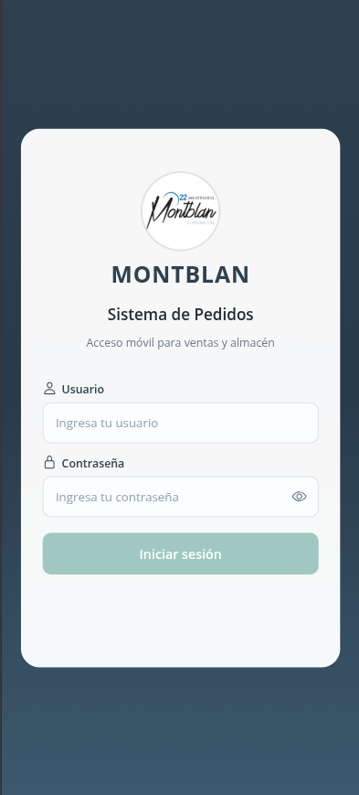
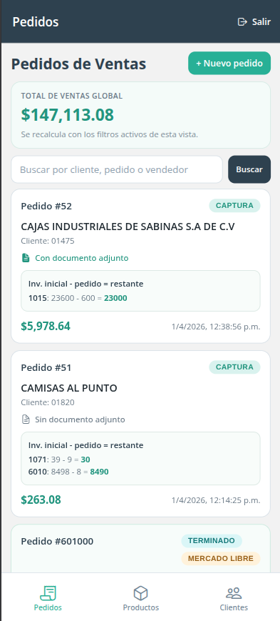
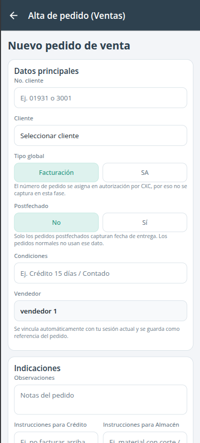
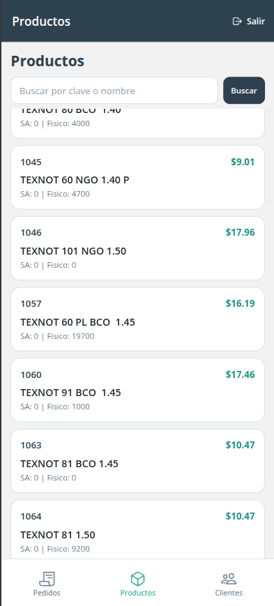
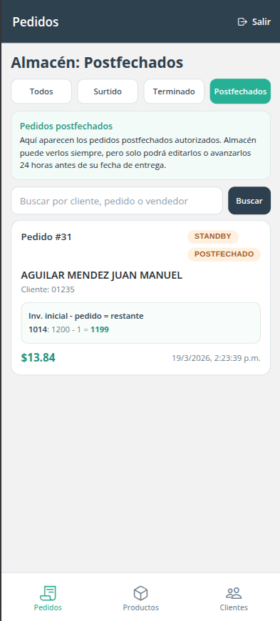
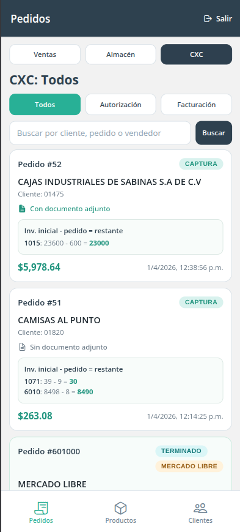

# Montblan Mobile

Aplicación móvil oficial de Montblan para la operación del flujo de pedidos, consulta de catálogos y ejecución de tareas de ventas, almacén y CXC contra el backend Yii2 mediante API REST.

## Alcance funcional

La app cubre los flujos operativos vigentes del sistema:

- autenticación por token Bearer
- captura y edición de pedidos en `CAPTURA`
- operación de autorización y facturación en `CXC`
- captura de surtido y rollos en `ALMACEN`
- consulta de clientes y productos
- soporte para pedidos postfechados
- soporte para evidencia de pedido
- soporte para pedidos de Mercado Libre y pedidos derivados
- cálculo de inventario proyectado y total global de ventas en listados móviles

## Stack

- Expo `~55.0.6`
- React Native `0.83.2`
- React `19.2.0`
- TypeScript `~5.9.2`
- React Navigation 7
- AsyncStorage para sesión local
- Expo Document Picker / File System / Sharing para adjuntos y archivos

## Configuración de la app

Metadatos relevantes definidos en [`app.json`](app.json):

- nombre: `Montblan`
- slug: `montblan-mobile`
- versión: `1.6.0`
- iOS `buildNumber`: `7`
- Android `versionCode`: `7`
- package Android: `com.lerco.montblan`

Perfiles EAS definidos en [`eas.json`](eas.json):

- `preview`: build interna Android en formato `apk`
- `production`: build Android en formato `app-bundle`

## Requisitos de desarrollo

- Node.js `20+`
- npm `10+`
- acceso de red al backend Montblan
- credenciales de Expo/EAS para builds Android

## Variable de entorno requerida

La app toma la URL base del backend desde:

```env
EXPO_PUBLIC_API_BASE_URL
```

Condiciones esperadas:

- la URL debe apuntar al backend Montblan accesible para el dispositivo o emulador
- la URL no debe incluir slash final
- el backend debe exponer la API REST v1 y aceptar autenticación Bearer

## Instalación y ejecución local

Instalar dependencias:

```bash
npm install
```

Levantar entorno de desarrollo:

```bash
npm run start
```

Comandos disponibles:

```bash
npm run android
npm run ios
npm run web
```

Validación de tipos:

```bash
npx tsc --noEmit
```

## Build Android con EAS

Build interna en APK:

```bash
npx eas build -p android --profile preview
```

Build de distribución en AAB:

```bash
npx eas build -p android --profile production
```

Si el build se ejecuta localmente con variables de entorno de sesión:

```bash
export EXPO_PUBLIC_API_BASE_URL=<backend-url-sin-slash-final>
npx eas build -p android --profile preview
```

## Estructura del proyecto

```text
src/
  navigation/          navegación principal y tabs
  modules/
    auth/              autenticación y sesión
    catalog/           clientes y productos
    orders/            flujo operativo de pedidos
  shared/
    api/               cliente HTTP y utilidades de red
    config/            lectura de variables de entorno
    storage/           persistencia local de sesión/token
    theme/             tokens visuales y estilos compartidos
```

## Integración con backend

La app consume el backend Montblan por API REST y depende de los contratos activos del proyecto web.

Capacidades integradas:

- `POST /auth/login`
- `GET /auth/me`
- listado, detalle, creación y actualización de pedidos
- transición de fases del flujo
- operación de almacén
- operación CXC en autorización y facturación
- consulta de clientes por clave
- consulta paginada de productos
- carga y lectura de evidencia

## Reglas operativas visibles en mobile

- ventas trabaja sobre pedidos en `CAPTURA`
- el vendedor se asigna automáticamente desde la sesión actual
- `No. pedido` se asigna en autorización por CXC
- los pedidos postfechados se exponen con filtro propio en almacén
- los pedidos de Mercado Libre muestran contexto específico y feedback de inventario proyectado
- el listado de ventas muestra un KPI de total global para los filtros activos de la vista
- la evidencia se refleja en las tarjetas de pedido con indicador visual de adjunto

## Capturas de la app

<table>
  <tr>
    <td></td>
    <td></td>
  </tr>
  <tr>
    <td></td>
    <td></td>
  </tr>
  <tr>
    <td></td>
    <td></td>
  </tr>
</table>
